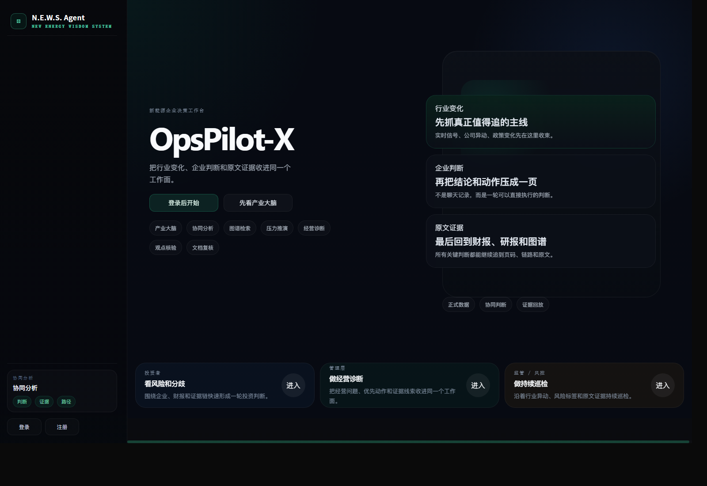
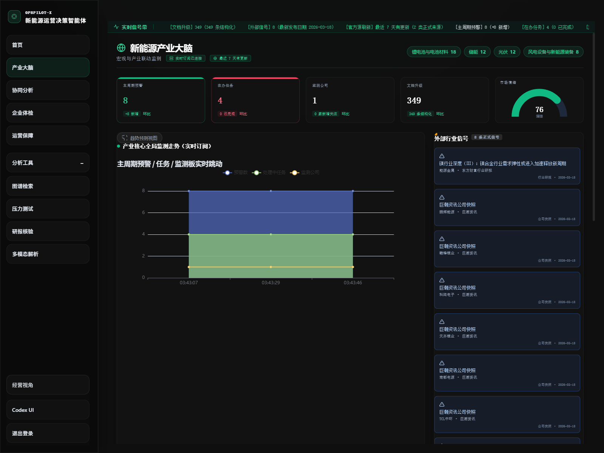
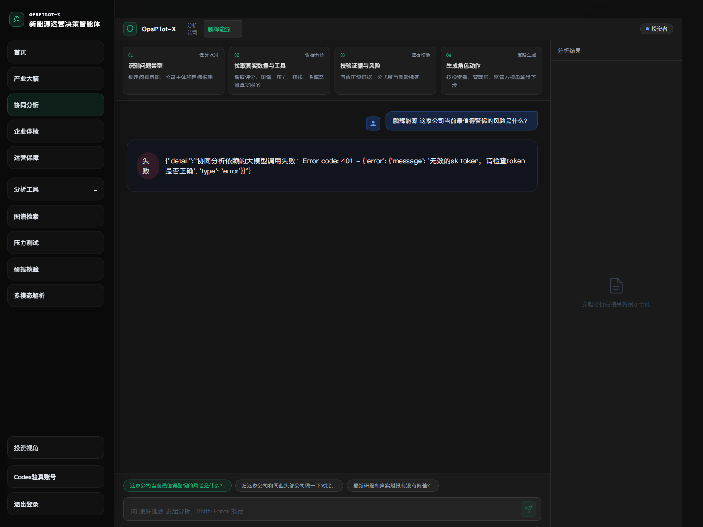

# OpsPilot-X

智能体赋能的新能源企业运营分析与决策支持系统。

OpsPilot-X 不是一个把聊天框套在数据上面的演示壳，而是一个围绕“看行业变化、看企业状态、做一轮判断、回到原文证据”组织起来的新能源决策工作台。它把正式财报、研报、公司快照、图谱链路、压力推演和文档复核收进同一个产品里，面向投资者、管理层和监管/风控三类角色提供不同视角下的真实判断能力。



## 这套系统能做什么

OpsPilot-X 当前围绕 7 个工作面组织：

| 工作面 | 面向的问题 | 真实后端能力 |
| --- | --- | --- |
| 产业大脑 | 行业今天发生了什么变化，哪些企业最值得继续盯 | 行业快照、正式信号流、风险企业排序、图表与事件聚合 |
| 协同分析 | 围绕一个问题，给出结论、动作和证据 | LLM Orchestrator、真实工具调用、证据回放、动作卡生成 |
| 图谱检索 | 这条判断链路是怎么传过去的 | Graph query、路径推理、节点证据导航 |
| 压力推演 | 一个冲击会先传到哪，再传到哪 | 场景推演、传导矩阵、波前日志、恢复动作 |
| 经营诊断 | 企业当前体质如何，问题先改什么 | 五维评分、风险信号、对标与时间线 |
| 观点核验 | 研报说法和财报原文是否一致 | Claim verify、财报/研报对照、证据回页 |
| 文档复核 | 财报页块、表格和 OCR 产物是否可靠 | 标准 OCR contract、文档产物治理、原文结构回放 |

## 产品界面

### 产业大脑



### 协同分析



## 为什么它不是“假页面”

这套系统当前坚持三条原则：

- 页面只挂真实后端能力，不做演示型假数据面板。
- 没接上的能力直接显示未就绪，不做运行态样本回退。
- 关键判断必须能继续追到图谱链路、财报页码或原文证据。

当前运行模式下，正式公司池和正式数据是唯一主链路；运行态样本回退已经关闭。

## 数据与能力底座

- 正式公司池：`data/universe/formal_company_pool.json`
- 官方财报、研报、公司快照：`data/raw`、`data/bronze`、`data/silver`
- 后端：`FastAPI`
- 前端：`Vue 3 + TypeScript + Vite`
- 数据库：`PostgreSQL 16 + pgvector`
- 检索：`Hybrid RAG`
- 图谱：`query-aware graph retrieval + multi-hop inference`
- 流式链路：`Redpanda / Kafka + Flink SQL + Paimon / Iceberg compatible lakehouse`
- 文档复核：标准 OCR contract，支持后续接入 `PaddleOCR-VL-1.5`

## 本地体验

### 1. 配置环境

```bash
pip install -e .
cp .env.example .env
```

至少要补这几项：

- `OPS_PILOT_OPENAI_API_KEY`
- `OPS_PILOT_POSTGRES_DSN`
- `OPS_PILOT_UNIVERSE_DATA_PATH`

### 2. 启动主链路

如果现在主要是在看产品、联调页面、跑协同分析和各个工作面，只开主链路即可：

```powershell
powershell -ExecutionPolicy Bypass -File .\scripts\start-core.ps1
```

启动后：

- 前端：`http://127.0.0.1:8080`
- API：`http://127.0.0.1:8000`
- PostgreSQL：`127.0.0.1:5432`

### 3. 启动流式 / 大数据链路

只有在做实时信号、Kafka/Flink、湖仓联调或演示时，才需要额外启动：

```powershell
powershell -ExecutionPolicy Bypass -File .\scripts\start-streaming.ps1
```

流式链路包括：

- `redpanda`
- `redpanda-console`
- `flink-jobmanager`
- `flink-taskmanager`

全部停掉：

```powershell
powershell -ExecutionPolicy Bypass -File .\scripts\stop-local-stack.ps1
```

## OCR 说明

当前文档复核页已经支持正式 OCR 通道，但不会假装“已经接通”。

如果要启用正式 OCR 服务，在 `.env` 中配置：

```env
OPS_PILOT_OCR_RUNTIME_ENABLED=true
OPS_PILOT_OCR_RUNTIME_MODE=service
OPS_PILOT_OCR_SERVICE_URL=http://127.0.0.1:8310
```

说明：

- `OPS_PILOT_OCR_SERVICE_URL` 指向你自己的 `PaddleOCR-VL` 服务。
- 没接通时，系统会明确显示未就绪。
- 不再自动回退为非正式 OCR 产物。

相关文档：

- [OCR 交付手册](docs/ocr_delivery_runbook.md)
- [Colab 最小操作说明](docs/colab_quickstart.md)

## 流水线命令

```bash
# 抓取正式财报和研报
ops-pilot-fetch-real-data --codes 601012,002129,300750

# 财报 PDF -> bronze chunks
ops-pilot-parse-official-reports --codes 601012,002129,300750

# 指标提取 -> silver metrics
ops-pilot-build-silver-metrics --codes 601012,002129,300750

# 公司快照 -> silver
ops-pilot-build-snapshot-silver --codes 601012,002129,300750

# 向量索引
ops-pilot-build-embeddings

# 外部信号流
ops-pilot-build-signal-stream
```

## 仓库结构

```text
frontend/                    Vue 前端
src/opspilot/                FastAPI、应用服务、数据访问、编排逻辑
data/                        正式数据、原始文档、bronze/silver 产物
streaming/                   Flink SQL、流式链路与 connector
docs/                        运行手册、交付文档、截图
scripts/                     本地启动、停止、清理脚本
tests/                       回归测试
```

## 开发验证

```bash
python -m pytest tests/ -q
python -m compileall src
cd frontend && npm run build
```

## 交付前建议

- 先跑主链路，把 7 个工作面看一遍。
- 只在需要演示实时链路时再起流式栈。
- OCR 没正式接通前，不把文档复核当成“已完成能力”对外讲。
- 交付前执行一次清理脚本：

```powershell
powershell -ExecutionPolicy Bypass -File .\scripts\clean-workspace.ps1
```

## License

MIT
